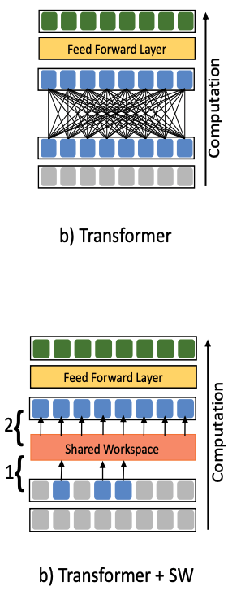
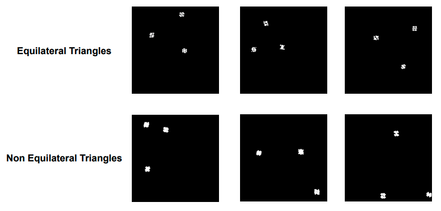

# Transformer with Shared Workspace

This is an unofficial implementation of Transformer with Shared Workspace introduced in the following paper: https://arxiv.org/abs/2103.01197
Images are also cited from the paper.

## Transformer with Shared Workspace
This model replaces the pairwise interactions of Transformer with a shared workspace. With a shared workspace, the model is expected to enable a better communication among different specialist modules.



## Dataset
This is a dataset of detecting equilateral triangles task. Each image contains 3 randomly placed culsters of points. The task for the model is to classify whether each image has an equilateral triangle or not.


## How to use this repo
1. Run ```git clone https://github.com/naomike/transformer_with_shared_workspace.git``` and ```cd transformer_with_shared_workspace```
2. Build a docker image by running ```docker image build -t transformer_sw_env:latest .```
3. Create a docker container by running ```docker run --gpus all --rm -it -v ${PWD}:/home/transformer_sw --name transformer_sw transformer_sw_env:latest /bin/bash```
4. Inside the container, run ```python dataset/create_triangles.py``` and you see the dataset created under ```data``` directory
5. Run ```python main.py```
